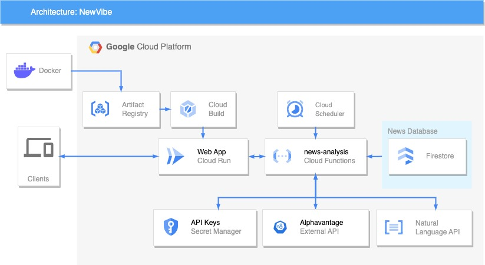

# NewVibe

[](https://flask.palletsprojects.com/en/) [](https://hub.docker.com/r/tadeop/financial-news-dashboard)
[](https://img.shields.io/badge/Google_Cloud-4285F4?style=for-the-badge&logo=google-cloud&logoColor=white)
[](https://www.linkedin.com/in/tadeo-deluca/)

Analyze financial news and simulate investment portfolios with cutting-edge AI technology.

NewVibe is a web application that provides a sentiment analysis Dashboards for all types of assets using Google Cloud AI services. The application allows users to analyze sentiment data from financial news and visualize the information in Dashboards.

Check out the [web](https://newvibe-zkyqw5ggha-rj.a.run.app/) page of the project: [https://newvibe-zkyqw5ggha-rj.a.run.app/](https://newvibe-zkyqw5ggha-rj.a.run.app/)

## Why NewVibe?

Created to simplify finance, this platform invites you to explore the financial world, make informed decisions, and test if there's real value in news-based investing

## Screenshots

<div align="center">
  
</div>

<div align="center">
  
</div>

## Architecture

Here is the architecture of the project with the Google Cloud services that are used and how they are connected:

<div align="center">
  
</div>

## Quickstart

To run this project locally, make sure you have Docker installed on your machine.

1. Clone this repository:

    ```bash
    git clone https://github.com/TadeopCreator/newvibe.git
    cd app
    ```

2. Place your `application_default_credentials.json` file (Google Cloud service account key) inside the main directory.

3. Build the Docker image:

    ```bash
    docker build -t newvibe ../
    ```

4. Run the Docker container:

    ```bash
    docker run -p 5000:5000 newvibe
    ```

5. Access the application in your browser at `http://localhost:5000`.

## Configuration

Before running the application, ensure you have the necessary dependencies listed in `requirements.txt` installed in your environment. Also, make sure to configure the `application_default_credentials.json` file for authentication with Google Cloud Firestore.

## Usage

- Once the application is running, access the provided URL in your browser to interact with NewVibe.
- Use the dashboard to explore sentiment data related to different assets.
- Ensure proper permissions and access to Google Cloud services for accurate data retrieval and analysis.

## License

This project is licensed under the [MIT License](LICENSE).
